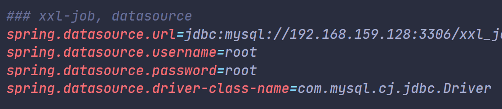
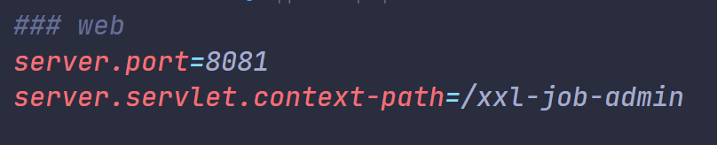
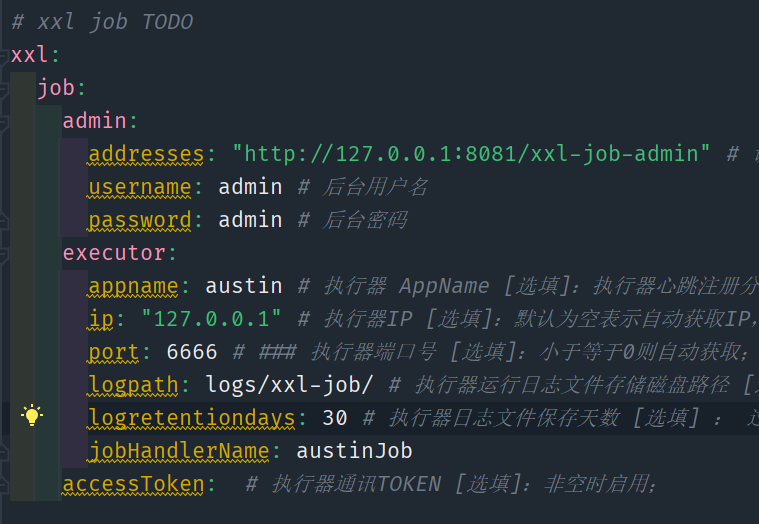

- 首先将xxl-job的代码拉取到本地：[xxl-job项目地址](https://github.com/xuxueli/xxl-job)
- 修改"xxl-job-admin\src\main\resources\application.properties"配置文件，主要是修改数据库相关的配置

- 注意项目的端口8080是否被占用，否则需要改变xxl-job的端口

- xxl.job.accessToken的值要和austin项目中配置的xxl.job.accessToken相同，也可以都为空
- 对整个项目重新打包，运行xxl-job-admin模块，在浏览器项目路径/xxl-job-admin/login路径可以查看运行网页，默认用户名和密码是admin/123456
- 回到austin项目，配置application.yml，主要是配置用户名和密码(我已在上一步将用户名和密码修改为了admin/admin)

- 目前项目关于任务调度的功能还在开发中